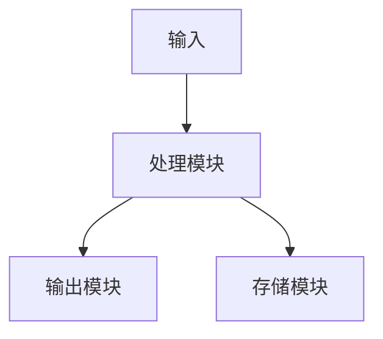

# {{title}}

> **类型**: {{type}}
> **版本**: {{version}}
> **许可证**: {{license}}
> **GitHub**: [{{github_repo}}]({{github_url}})

## 简介

### 项目背景

<!-- 为什么创建这个工具/脚本 -->

### 设计目标

<!-- 希望解决什么问题 -->

## 功能特性

### 核心功能

- **功能1**: {{feature1}}
- **功能2**: {{feature2}}
- **功能3**: {{feature3}}

### 特色功能

<!-- 与众不同的功能 -->

## 使用方法

### 环境要求

```bash
# 系统要求
{{system_requirements}}

# 依赖安装
{{dependencies}}
```

### 安装部署

#### 快速安装

```bash
{{quick_install}}
```

#### 源码编译

```bash
{{source_install}}
```

### 配置说明

#### 基本配置

```{{config_language}}
{{basic_config}}
```

#### 高级配置

```{{config_language}}
{{advanced_config}}
```

### 使用示例

#### 基本用法

```bash
{{basic_usage}}
```

#### 高级用法

```bash
{{advanced_usage}}
```

## 实现原理

### 架构设计

<!-- 整体架构说明 -->



### 核心算法

<!-- 关键算法说明 -->

```{{language}}
// 核心算法实现
function coreAlgorithm(input) {
  // 算法逻辑
  return result;
}
```

### 性能优化

<!-- 性能优化措施 -->

## 开发指南

### 代码结构

```
{{project_structure}}
```

### 扩展开发

<!-- 如何扩展功能 -->

### 测试方法

```bash
# 运行测试
{{test_command}}
```

## 应用场景

### 适用场景

- **场景1**: {{scene1}}
- **场景2**: {{scene2}}
- **场景3**: {{scene3}}

### 成功案例

<!-- 实际应用案例 -->

## 注意事项

### 已知问题

- [ ] {{issue1}}
- [ ] {{issue2}}

### 使用限制

<!-- 使用时的限制条件 -->

### 安全警告

<!-- 安全相关注意事项 -->

## 更新日志

### {{version}} ({{release_date}})

- {{change1}}
- {{change2}}
- {{change3}}

### 历史版本

| 版本 | 发布日期 | 主要更新 |
|------|----------|----------|
| {{prev_version1}} | {{prev_date1}} | {{prev_change1}} |
| {{prev_version2}} | {{prev_date2}} | {{prev_change2}} |

## 贡献指南

### 问题反馈

<!-- 如何反馈问题 -->

### 提交PR

<!-- 如何贡献代码 -->

### 开发规范

<!-- 代码规范要求 -->

## 相关资源

### 文档链接

1. [官方文档]({{official_docs}})
2. [API参考]({{api_docs}})
3. [用户手册]({{user_manual}})

### 类似项目

- [项目1]({{project1_url}}) - {{project1_desc}}
- [项目2]({{project2_url}}) - {{project2_desc}}

---

**作者**: {{author}}
**维护者**: {{maintainer}}
**创建时间**: {{date}}
**最后更新**: {{update_date}}

> 如果这个工具对你有帮助，请考虑给它一个Star ⭐
> 问题反馈: {{issue_url}}
> 讨论交流: {{discussion_url}}
